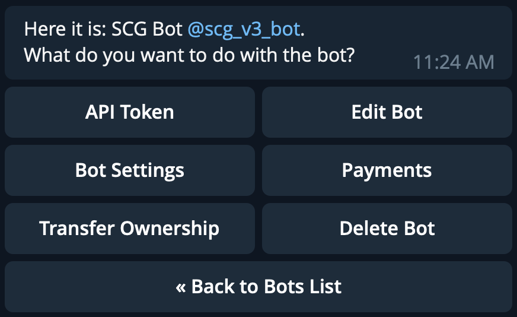

# SCG TELEGRAM BOT
this bot is used to manage the company's groups.

### What you'll need

- a telegram bot with Group Privacy off.
  - [how to create a bot](https://core.telegram.org/bots#6-botfather)
  - [how to turn off Group Privacy](https://teleme.io/articles/group_privacy_mode_of_telegram_bots)
- a heroku app and a postgres database
  - [how to create a heroku app and set up a database](https://dev.to/prisma/how-to-setup-a-free-postgresql-database-on-heroku-1dc1)
- a fork of this repository

### Setup Steps

1.  Connect your heroku app to your fork
2.  Setup evironment variables (see [.env.example](/.env.example))
3.  Send /mybots to Bot Father -> select bot.
    1. `BOT_USERNAME`, @[your_bot_user name]
    2. `BOT_TOKEN`, choose API Token
    
4.  Deploy migration
    1. Get to your app's dashboard
    2. Click `More` button
    3. Click `Run Console`
    4. Type `bash` -> click `Run`
    5. Type `npx prisma migrate deploy` -> press `Enter`
5.  To get `READING_GROUP_ID`, send `/info -g` while in the reading group
6.  Create a day count record with `/newdc`, while in the reading group then set up `READING_GROUP_DAY_COUNT_ID`
7.  To create a user record, send `#1 {your name}` to the reading group.
8.  To set yourself as Admin (the first ever. after that, you can use `/newadmin`), you have to edit your data using a Postgres DB Management Tool like `pgAdmin`
9.  Message `/check` to the bot on telegram to see if you configure it correctly.
10. Message `/help` to the bot on telegram to see all the commands you can use.
